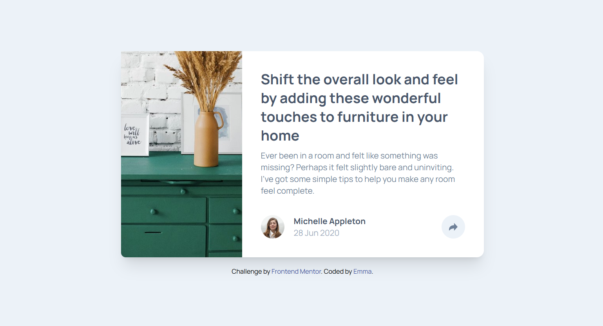

# Frontend Mentor - Article preview component solution

This is a solution to the [Article preview component challenge on Frontend Mentor](https://www.frontendmentor.io/challenges/article-preview-component-dYBN_pYFT). Frontend Mentor challenges help you improve your coding skills by building realistic projects. 

## Table of contents

- [Overview](#overview)
  - [The challenge](#the-challenge)
  - [Screenshot](#screenshot)
  - [Links](#links)
- [My process](#my-process)
  - [Built with](#built-with)
  - [What I learned](#what-i-learned)
  - [Continued development](#continued-development)
  - [Useful resources](#useful-resources)
- [Author](#author)
- [Acknowledgments](#acknowledgments)

## Overview

### The challenge

Users should be able to:

- View the optimal layout for the component depending on their device's screen size
- See the social media share links when they click the share icon

### Screenshot



## My process

### Built with

- Semantic HTML5 markup
- Tailwind CSS
- JavaScript for interaction (visibility toggle for share links)
- Google Fonts (Manrope)
- Mobile-first design

### What I learned

During the development of this project, I reinforced my understanding of the following :

- Tailwind CSS utilities for layout, color, and responsive design
- Handling dynamic visibility using JavaScript to toggle elements based on user interaction
- How to organize an article preview layout that adjusts for different screen sizes
- Integrating social media share functionality with interactive buttons

Here is an example of JavaScript used to toggle the visibility of the share links:

```js
const liste_reseaux = document.getElementById("liste_reseaux");

function toggleVisibility() {
  if (liste_reseaux.classList.contains("opacity-0")) {
    liste_reseaux.classList.remove("opacity-0");
    liste_reseaux.classList.add("opacity-1");
  } else {
    liste_reseaux.classList.remove("opacity-1");
    liste_reseaux.classList.add("opacity-0");
  }
}

document.getElementById("partager").addEventListener("click", toggleVisibility);
document
  .getElementById("partager_banniere")
  .addEventListener("click", toggleVisibility);
```

### Continued development

Moving forward, I want to refine my knowledge of CSS Grid to handle more complex layouts and experiment with other interactive elements like modals and tooltips. I will also focus on improving the accessibility of interactive elements.

### Useful resources

- [Tailwind CSS Documentation](https://tailwindcss.com/docs) - A resource for learning how to implement responsive layouts and customize utilities.
- [MDN Web Docs on Event Listeners](https://developer.mozilla.org/en-US/docs/Web/API/EventTarget/addEventListener) - This helped me understand how to use event listeners effectively to trigger JavaScript functionality.

## Author

- Website - [Emma Roizot](https://www.your-site.com)
- Frontend Mentor - [@ashandcompany](https://www.frontendmentor.io/profile/ashandcompany)

## Acknowledgments

Thanks to Frontend Mentor for providing such a well-structured challenge. Special thanks to the open-source community and all the resources I used to complete this project.
